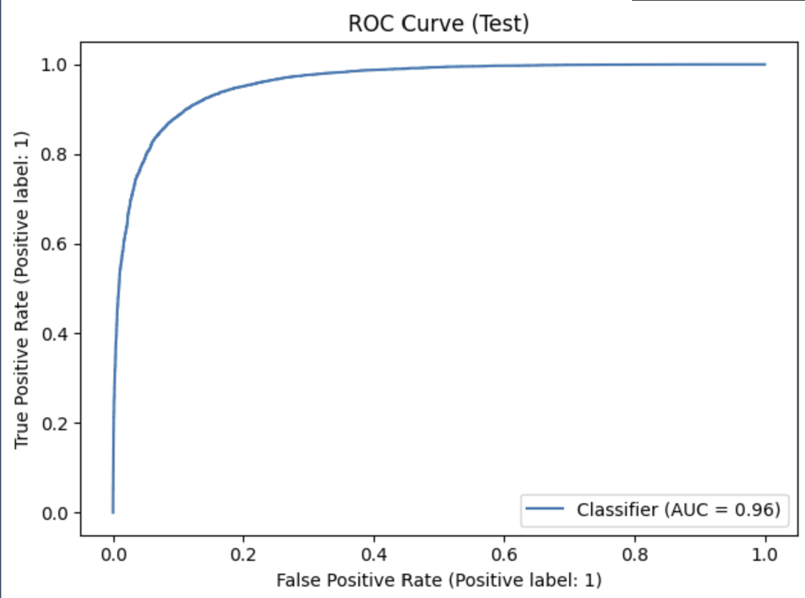

# The-Voice-of-the-Audience-Sentiment-Analysis-on-IMDB-Reviews
End-to-End NLP Pipeline for Sentiment Analysis (IMDB Reviews)

## Project Overview
This project demonstrates how to build a full machine learning pipeline for sentiment analysis, leveraging Azure Databricks for large-scale training and Power BI for business insights. Using the IMDB reviews dataset, I implemented an NLP workflow that classifies movie reviews as positive or negative, and translated model results into actionable insights for decision-making.

This project highlights skills in data engineering, machine learning, cloud platforms, and BI reporting.

## Business Questions

* Can we automatically classify customer reviews (positive vs. negative) to save manual effort in sentiment analysis?
* How accurate is the baseline Logistic Regression model, and is it reliable for production use?
* What are the most common errors in classification (false positives/false negatives), and what insights do they provide for model improvement?
* How can stakeholders consume these results in a dashboard for decision-making?

## Methodology
### Tech Stack
* Data Engineering: Azure Data Factory, Azure Data Lake
* ML & Analytics: Python, scikit-learn, pandas, numpy
* Big Data Platform: Azure Databricks (PySpark + MLlib integration)
* Visualization: Power BI
* Version Control: GitHub

### Data Ingestion
* Pulled IMDB dataset into Azure Data Lake via Azure Data Factory.
* Organized storage into raw and curated layers.

### Data Preprocessing & Modeling

* Preprocessing: tokenization, TF-IDF vectorization.
* Baseline model: Logistic Regression classifier (scikit-learn).
* Evaluated with accuracy, F1-score, and ROC-AUC.

### Model Evaluation

* Generated predictions on both train and test sets.
* Analyzed results with confusion matrix, ROC curve, and classification metrics.

## Visualization & Business Insights

* Exported results to Azure Data Lake.
* Connected Power BI for live dashboarding.
* KPI Cards (Accuracy, F1, ROC-AUC).
* Confusion Matrix (to show true vs. predicted).
* Probability Distributions (confidence of predictions).
* Misclassified Review Table (for error analysis).

### Results

* Accuracy: ~89%
* F1 Score: ~89%
* ROC-AUC: ~96% 

### Key Insights

* The model achieves strong accuracy and recall, meaning it detects positive/negative reviews reliably.
* False positives (negative reviews classified as positive) may lead to overestimating satisfaction → important for customer support teams.
* False negatives (positive reviews classified as negative) may cause missed opportunities for promotion or engagement.
* Business dashboards in Power BI allow non-technical stakeholders to track performance, drill into errors, and monitor KPIs over time.

### These results show that even a simple baseline model can perform well on text sentiment tasks, making it useful in real-world customer feedback monitoring systems.

